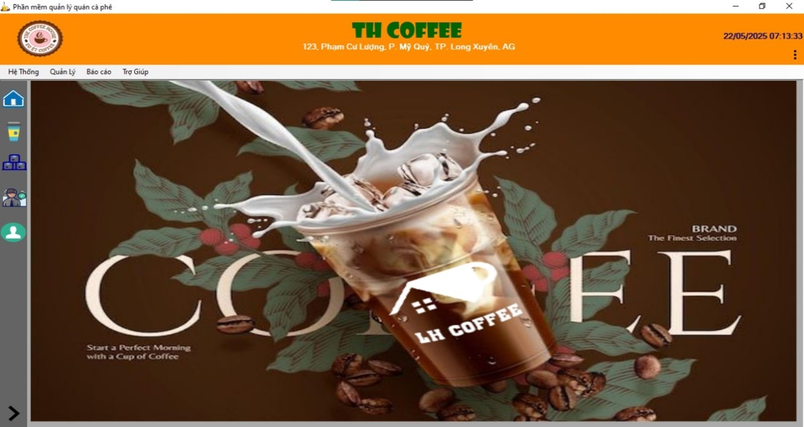
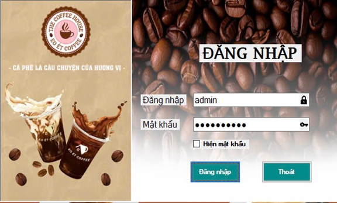
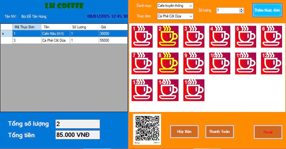
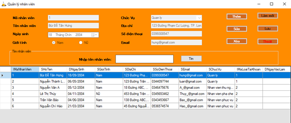
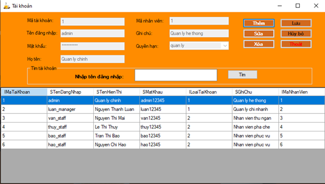
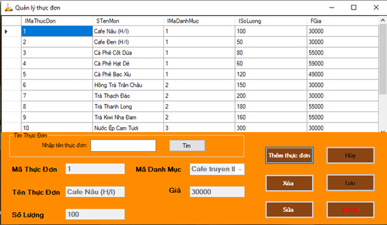
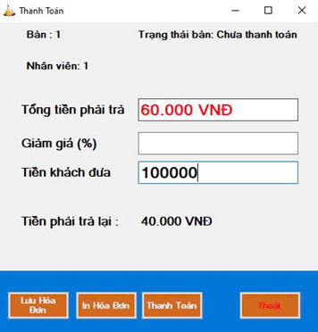
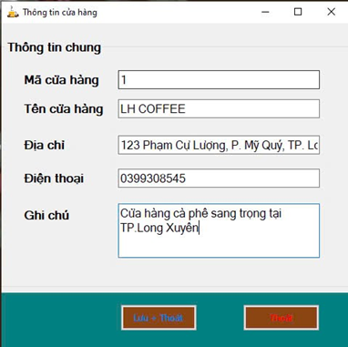

# QuanLyQuanCafe
 Đồ án môn học xây dựng phần mềm quản lý quán cafe - Coffee Shop Management System built with .NET MVC

## Thông tin môn học

- Mã học phần : IMS501
- Tên học phần : Lập trình quản lý 
- Giảng viên : Nguyễn Hoài Nam
- Sinh viên thực hiện : Bùi Đỗ Tấn Hưng - DTH225658
- Khoa Công nghệ thông tin, Trường Đại học An Giang

## Nội dung thực hiện
### 1. Lý do chọn đề tài
- Một phần mềm quản lý giúp chủ quán tiết kiệm thời gian, tăng độ chính xác, và dễ dàng theo dõi hoạt động kinh doanh.
- Việc xây dựng phần mềm quản lý quán cà phê phù hợp xu hướng chuyển đổi số.

### 2. Mô hình nghiệp vụ
1.	Quản lý thực đơn:
-	Quản lý danh mục món ăn, cập nhật món mới, sửa/xóa món.
-	Hiển thị danh sách món ăn theo từng danh mục.
-	Lưu trữ giá món ăn và thông tin liên quan.
2.	Đặt món và phục vụ:
-	Nhân viên phục vụ nhận đơn đặt món từ khách hàng.
-	Ghi nhận số lượng món theo từng bàn.
-	Cho phép cập nhật, thêm, hoặc hủy món đã gọi.
3.	Thanh toán:
-	Tính toán tổng tiền, áp dụng giảm giá (nếu có).
-	Lưu trữ hóa đơn chưa thanh toán và đã thanh toán.
-	Xử lý thanh toán và in hóa đơn cho khách hàng.
4.	Quản lý nhân viên và tài khoản:
-	Phân quyền cho quản lý, nhân viên phục vụ, nhân viên thu ngân.
-	Quản lý thông tin tài khoản đăng nhập.
5.	Báo cáo và sao lưu:
-	Báo cáo doanh thu theo ngày, tháng.
-	Sao lưu và phục hồi dữ liệu đảm bảo an toàn thông tin.

## Thiết kế giao diện

  
  
  

  
 
   
 

   
 

  
  
   

## Thông tin kỹ thuật
Máy chủ / Hệ quản trị CSDL:

- Microsoft SQL Server 2019
- SQL Server Management Studio (SSMS)

Ngôn ngữ lập trình:
- C# (.NET Framework)
- SQL (T-SQL)

Công nghệ:
- Windows Forms (.NET Framework)
- ADO.NET (kết nối và thao tác cơ sở dữ liệu)

Mô hình phân lớp:
- Presentation Layer (WinForms UI)
- Business Logic Layer (Class Library)
- Data Access Layer (Class Library, ADO.NET)

Thư viện:
- System.Data.SqlClient (ADO.NET)
- Các thư viện mặc định trong .NET Framework

Công cụ:
- Visual Studio 2019 / 2022
- SQL Server Management Studio (SSMS)
- Git / GitHub (quản lý mã nguồn)
